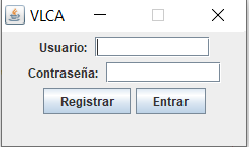
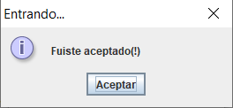
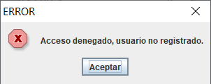
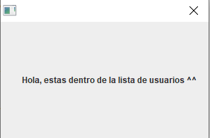
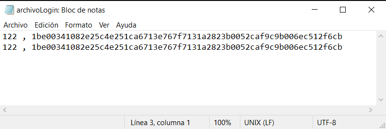

# Programa control acceso con cifrado SHA-256 usando Java.
 
 *Se desarrollo un programa que usa el formato MVC (Modelo, Vista y Controlador) con el fin de registrar usuarios, dandoles la oportunidad de registrar un nuevo usuario para pasar a la siguiente ventana, en caso de que este no se encuentre registrado, se le denegara el acceso y se le volvera a preguntar la contraseña.*
 
 *Se uso un cifrado en la contraseña llamado SHA-256 (sugerido por ser mas reciente en version).
 
 # *Link del funcionamiento del programa.*
 
 *https://flipgrid.com/baed9531*
 
 # *Elementos visuales y funcionamiento.*
 *~Dos textLabel que nos muestran en que parte hay que ingresar nuestras credenciales(password y contraseña).*
 
 *~Dos JButton, uno para Entrar dependiendo de las credenciales ingresadas, y el otro para registrar Usuarios.*
 
 *~Un JPassword para ocultar nuestra contraseña.*
 
 *~Un JTextField para ingresar el usuario.*
 
 # *Pre-requisitos. 📋*
 
 *Este programa usa librerias propias de Java invocadas en cada clase correspondiente, GitHub para subir nuestras clases y nuestro .jar y un IDE Netbeans 8.2 gratuito.*
 
 # *Agradecimientos.*
 
*--Agradezco a nuestro docente (Levy Rojas Carlos Rafael) por introducirnos a lo que necesitabamos en nuestro programa para que funcionara.*

*--A mi por mi ezfuerzo al investigar de diferentes fuentes y realizar el programa.*

# *Referencias.*

*https://anabelisa.co/readme/*

*http://chuwiki.chuidiang.org/index.php?title=Encriptacion_con_Java*

*https://www.youtube.com/watch?v=ONXc2a0u4cc*

# Resultados.

Elementos visuales/vista.

Aceptado al tener un usuario registrado.

Denegado al no tener un usuario registrado.

Acceso a la ventana secundaria al tener un usuario registrado.

Informacion dentro del archivo(Usuario y contraseña(Cifrado en SHA256)).

 
